# 네트워크 개요

네트워크는 컴퓨터 등의 장치들이 통신 기술을 이용하여 구축하는 연결망을 지칭하는 용어입니다.

## 1. 네트워크의 기초
네트워크란 **노드(node)** 와 **링크(link)** 가 서로 연결되어 있거나 연결된 상태에서 리소스를 공유하는 집합을 의미합니다.  
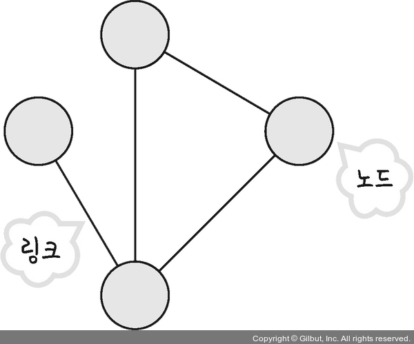  
- **노드**: 서버, 라우터, 스위치 등의 네트워크 장치  
- **링크**: 유선 또는 무선 연결  

### 1.1. 처리량과 지연 시간

- **좋은 네트워크**: 많은 처리량을 처리할 수 있고 지연 시간이 짧으며 장애 빈도가 적고 보안이 좋은 네트워크
- **처리량**: 링크 내에서 성공적으로 전달된 데이터의 양, 즉 얼마나 많은 트래픽을 처리했는지를 나타냅니다.  
  '많은 트래픽을 처리한다 = 많은 처리량을 가진다'  
  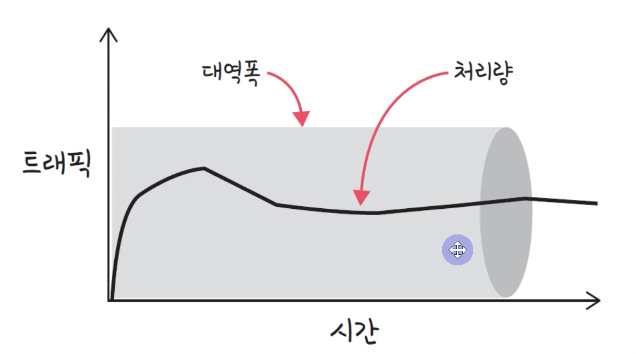  
  - **트래픽이 많아졌다** = 흐르는 데이터가 많아졌다  
  - **처리량이 많아졌다** = 처리되는 트래픽이 많아졌다  

- **지연 시간**: 요청이 처리되는 시간, 메시지가 두 장치 사이를 왕복하는 데 걸리는 시간  
  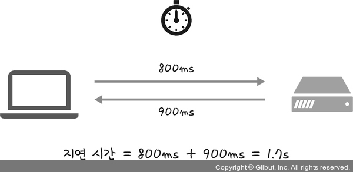  
  - 지연 시간은 매체 타입(무선, 유선), 패킷 크기, 라우터의 패킷 처리 시간에 영향을 받습니다.

### 1.2. 네트워크 토폴로지와 병목 현상

- **네트워크 토폴로지**: 노드와 링크가 어떻게 배치되어 있는지, 즉 연결 형태를 의미합니다.

#### 트리 토폴로지
- **트리(tree) 토폴로지**: 계층형 토폴로지로, 트리 형태로 네트워크가 배치됩니다.  
  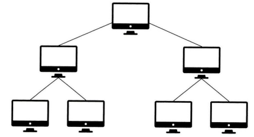  
  - 노드의 추가, 삭제가 쉽지만, 특정 노드에 트래픽이 집중될 때 하위 노드에 영향을 미칠 수 있습니다.

#### 버스 토폴로지
- **버스 토폴로지**: 중앙 통신 회선 하나에 여러 개의 노드가 연결되어 공유하는 구조로, 근거리 통신망(LAN)에서 사용됩니다.  
  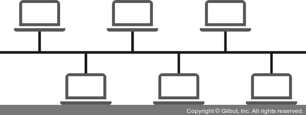  
  - 설치 비용이 적고 신뢰성이 우수하며, 노드를 쉽게 추가하거나 삭제할 수 있습니다.
  - 그러나 **스푸핑**이라는 문제점이 있습니다.  
    - **스푸핑**: 송신 패킷이 원래 수신자에게 가지 않도록 속여 다른 호스트에 전송되게 하는 공격 기법  
    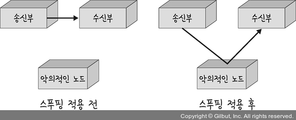

#### 스타 토폴로지
- **스타 토폴로지**: 중앙에 있는 노드에 모든 노드가 연결된 구조  
  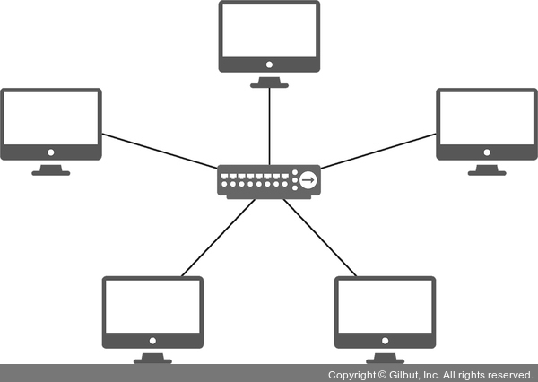  
  - 노드를 추가하거나 에러를 탐지하기 쉽고, 패킷 충돌 발생 가능성이 적습니다.  
  - 하지만 **중앙 노드**에 장애가 발생하면 전체 네트워크가 사용할 수 없으며, 설치 비용이 높습니다.

#### 링형 토폴로지
- **링형 토폴로지**: 각각의 노드가 양 옆의 두 노드와 연결되어, 전체적으로 고리처럼 통신하는 망 구성 방식  
  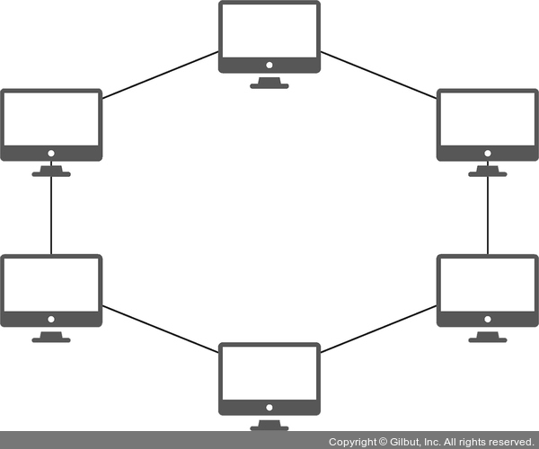  
  - 노드 수가 증가해도 네트워크 손실이 거의 없으며, 충돌 발생 가능성이 적습니다.  
  - 하지만 네트워크 구성 변경이 어렵고, 회선에 장애가 발생하면 전체 네트워크에 큰 영향을 미칩니다.

#### 메시 토폴로지
- **메시 토폴로지**: 망형 토폴로지로, 그물망처럼 연결된 구조  
  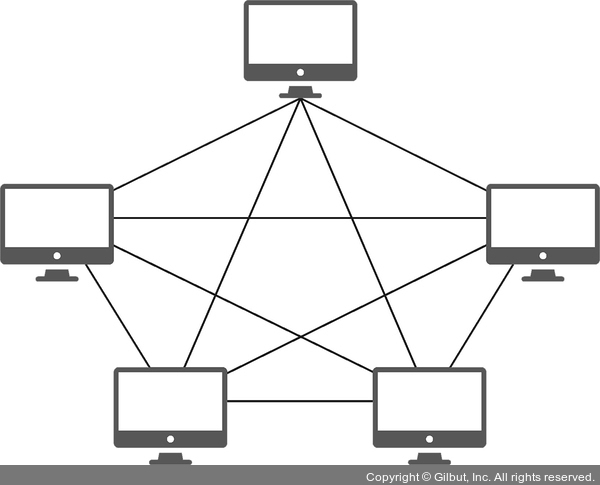  
  - 단말 장치에 장애가 발생해도 여러 경로가 존재해 네트워크를 계속 사용할 수 있습니다.
  - 하지만 노드를 추가하기 어렵고, 구축 및 운영 비용이 고가입니다.

### 병목 현상
- **병목 현상**: 네트워크의 토폴로지가 중요한 이유는 병목 현상을 찾을 때 중요한 기준이 되기 때문입니다.  
  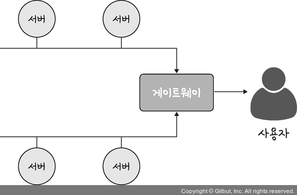  
  - 예를 들어, 서비스에서 병목 현상이 발생하면 사용자는 지연 시간이 길어집니다.  
  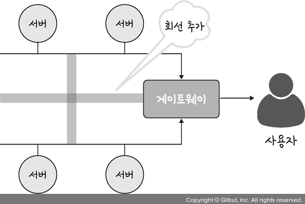  
  - 네트워크 토폴로지를 분석해 서버 간 회선을 추가하면 병목 현상을 해결할 수 있습니다.
